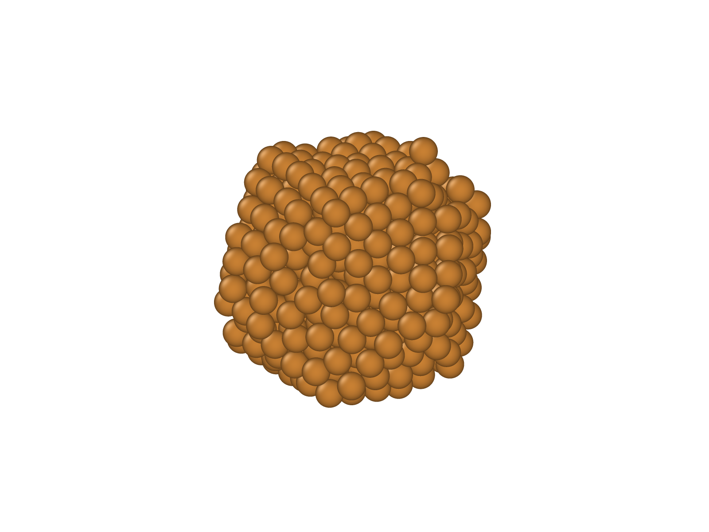
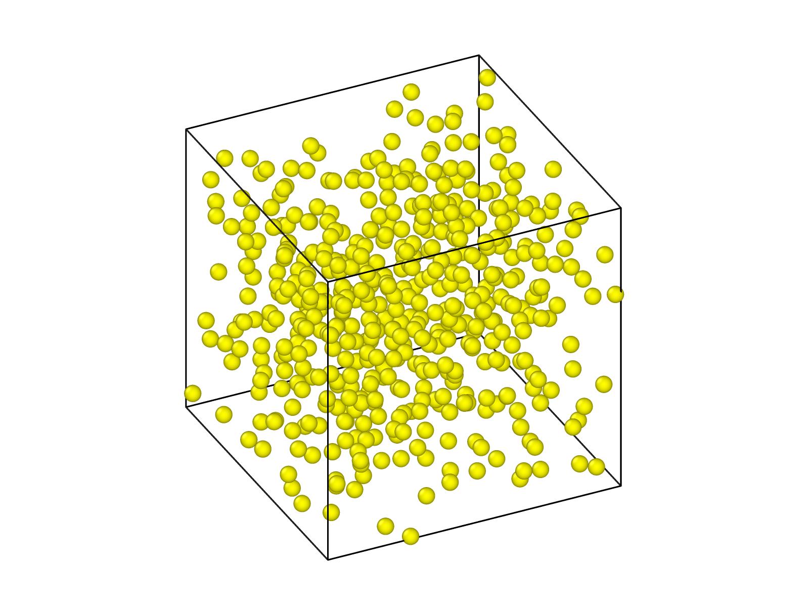

# Computational Materials Science Projects  
## LAMMPS, Quantum ESPRESSO & OVITO Simulations

This repository contains a collection of computational materials science projects developed using:

- [LAMMPS](https://www.lammps.org/)
- [Quantum ESPRESSO](https://www.quantum-espresso.org/)
- [OVITO](https://www.ovito.org/)

The projects were created in the context of coursework and research-oriented study on:

- Molecular Dynamics (MD)
- Molecular Statics
- Monte Carlo simulations
- Atomistic materials modeling
- Density Functional Theory (DFT)
- Nanomaterials and atomic structure visualization

The repository includes:

- Simulation input/output files
- Source scripts
- Python analysis and post-processing scripts
- Figures and generated results
- Supporting datasets
- Visualization files generated with OVITO
- A detailed PDF report for each project explaining:
  - theoretical background,
  - simulation methodology,
  - computational parameters,
  - analysis process,
  - and conclusions.

---

# OVITO Visualizations

The repository also contains atomistic visualizations generated using OVITO for structural analysis and visualization of nanoparticles and crystal systems.

## Example Nanoparticle Structures

### Nanoparticle Visualization 1

---

### Nanoparticle Visualization 2

---

# Projects Overview

## 1. Verification of the Ideal Gas Law using Molecular Dynamics

Study and numerical verification of the ideal gas law through Molecular Dynamics simulations.

Main topics:
- Pressure–temperature relationship
- Particle motion and collisions
- Thermodynamic equilibrium
- Statistical behavior of gases

Tools:
- LAMMPS

---

## 2. Selection of Appropriate Parameters for Molecular Dynamics Simulations

Investigation of how simulation parameters affect stability and accuracy in MD simulations.

Main topics:
- Time step selection
- Equilibration
- Boundary conditions
- Temperature and pressure control
- Numerical stability

Tools:
- LAMMPS

---

## 3. Nanoparticle Melting

Simulation and analysis of the melting behavior of nanoparticles at the atomic scale.

Main topics:
- Phase transitions
- Structural evolution
- Potential energy analysis
- Temperature-dependent behavior

Tools:
- LAMMPS
- OVITO

---

## 4. Monte Carlo vs Molecular Dynamics

Comparative study between Monte Carlo and Molecular Dynamics methods.

Main topics:
- Sampling techniques
- Statistical mechanics
- Computational efficiency
- Advantages and limitations of each method

Tools:
- LAMMPS
- Monte Carlo algorithms

---

## 5. Molecular Statics

Energy minimization and structural analysis of crystalline materials using Molecular Statics techniques.

Main topics:
- Energy minimization
- Lattice constant optimization
- Cohesive energy
- Vacancy and defect calculations

Tools:
- LAMMPS
- OVITO

---

## 6. Introduction to Density Functional Theory (DFT)

Introduction to first-principles electronic structure calculations using Density Functional Theory.

Main topics:
- SCF calculations
- Crystal structures
- Electronic band structure
- Convergence testing
- Quantum mechanical modeling of materials

Tools:
- Quantum ESPRESSO

---

# Software Requirements

## LAMMPS
Official website:

https://www.lammps.org/

## Quantum ESPRESSO
Official website:

https://www.quantum-espresso.org/

## OVITO
Official website:

https://www.ovito.org/

---

# Educational Purpose

This repository is intended for:

- students learning computational materials science,
- introductory atomistic simulations,
- Molecular Dynamics and DFT coursework,
- and researchers interested in simulation workflows using LAMMPS, Quantum ESPRESSO, and OVITO.

The projects combine theoretical understanding with practical implementation, visualization, and simulation analysis.

---

# Topics Covered

- Molecular Dynamics (MD)
- Monte Carlo Methods
- Molecular Statics
- Density Functional Theory (DFT)
- Computational Physics
- Materials Science
- Atomistic Simulations
- Crystalline Materials
- Nanomaterials
- Electronic Structure Calculations
- Atomistic Visualization

---

# Author

Klajdi Cami
Department of Physics  
Aristotle University of Thessaloniki

---